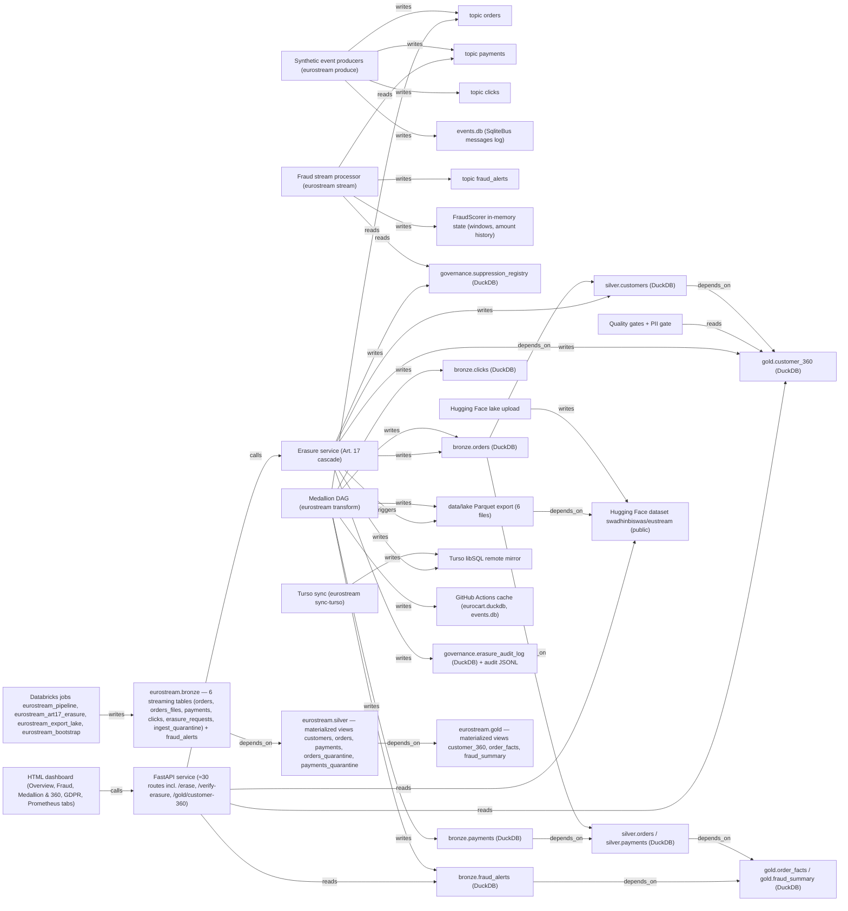

# retailer-x — Discovery & Assessment — DRAFT, unreviewed

> **Draft built from 196 unreviewed records.** Review them in Velox → Workspace → Review, then ask for the final report.

> Built with: databricks-discovery skills · Databricks agent skills v0.2.26 · Databricks CLI v1.18.0

## Contents

- [Part A — Discovery](#part-a--discovery)
  - [1. Executive summary](#1-executive-summary)
  - [2. Business context & target-state requirements](#2-business-context--target-state-requirements)
  - [3. Data landscape & current-state architecture](#3-data-landscape--current-state-architecture)
  - [4. Workload catalogue](#4-workload-catalogue)
  - [5. Data dependencies & lineage, including external services](#5-data-dependencies--lineage-including-external-services)
- [Part B — Assessment](#part-b--assessment)
  - [6. Governance, PII & GDPR gaps](#6-governance-pii--gdpr-gaps)
  - [7. Databricks security posture](#7-databricks-security-posture)
  - [8. Technical debt register](#8-technical-debt-register)
  - [9. Migration complexity & scope](#9-migration-complexity--scope)
  - [10. Target architecture & component mapping](#10-target-architecture--component-mapping)
  - [11. Recommendations, phased roadmap & cost estimate](#11-recommendations-phased-roadmap--cost-estimate)
  - [12. Risk register, assumptions & open decisions](#12-risk-register-assumptions--open-decisions)
- [Appendix](#appendix)
  - [A. Evidence](#a-evidence)
- [Evidence sufficiency — Retailer X (run-01)](#evidence-sufficiency--retailer-x-run-01)
  - [B. Best-practice references](#b-best-practice-references)
  - [C. Stakeholder questionnaire](#c-stakeholder-questionnaire)

# Part A — Discovery

## 1. Executive summary

> This report is for **the Retailer X platform owner (name: ?)** to decide **which workloads move to Databricks, in which waves, and what must be fixed first (GDPR erasure, EU residency, security posture), including whether the existing workspace deployment is kept, redone or discarded**, before **the migration is committed (date: ?)**.  `assumed` — OQ-01, OQ-02

**Readiness: at most 1 / 5** — the lowest scored dimension; 1 of 5 are not scored yet and any of them can pull it lower.

| Dimension | Score | Basis | Evidence |
|---|---|---|---|
| Data | not scored | needs real source systems and production volumes (OQ-04) | SELECT count(*) FROM eurostream.bronze.orders → 1500 |
| Logic / code | 3 / 5 | 18 rules recovered: 7 VERIFIED, 4 CONFLICT, 4 CODE-ONLY, 2 CONFIG-ONLY, 1 UNRESOLVED; the conflicts sit on the erasure/consent critical path. | src/eurostream/warehouse.py:484 |
| Governance & PII | 1 / 5 | PII processed in us-east-2 against ADR 0001; public HF copy; erasure misses bus, HF and the rebuild path; no UC tags, masks or grants. | system.billing.usage → *_US_EAST_OHIO |
| Security | 2 / 5 | Read as workspace-assessor (the assessment service principal). 31 checks pass, 24 fail (4 high); weighted coverage 75% of the SAT catalog | posture.json |
| Operations | 2 / 5 | Existing jobs run as a person and mostly failed (pipeline 1/5); the deployed code is not in VCS; CI deploys on every push. | system.lakeflow.job_run_timeline → eurostream_pipeline runs=5 ok=1 |

### Top 5 risks

| # | Severity | Risk | When migrated | Evidence |
|---|---|---|---|---|
| FND-09 | high | Consent: one historical opt-out blocks a later opt-in forever | carried | stated: src/eurostream/warehouse.py:496 |
| FND-01 | critical | EU customer PII is stored and processed in a US-region workspace | redesign | stated: SELECT … FROM system.billing.usage → PREMIUM_JOBS_SERVERLESS_COMPUTE_US_EAST_OHIO; docs/adr/0001-eu-region-choice.md:22 |
| FND-02 | high | Erased customers reappear in Silver/Gold on the next full rebuild | redesign | stated: src/eurostream/warehouse.py:484 |
| FND-03 | high | Erasure never reaches the event bus; topics carry clear PII | redesign | stated: src/eurostream/producers.py:114; src/eurostream/governance/erasure.py:171 |
| FND-04 | high | Pseudonymized customer data is published to a public Hugging Face dataset | redesign | stated: .github/workflows/orchestrate.yml:90 |

### Recommendation

**Recommendation: go, but conditional. Rebuild in an EU workspace; do not lift the current deployment.**

EuroStream maps cleanly onto Databricks. The medallion DAG becomes a Lakeflow Declarative Pipeline, the fraud scorer becomes a Structured Streaming job, the Art. 17 cascade becomes a Lakeflow Job, and the API becomes a Databricks App. Six of the 26 code findings are resolved by the target platform itself: watermark data loss, scorer state, silent drops, shared connections, hand-written lineage and the CI cache.

Three things block a "just migrate" plan:

1. **Residency.** The workspace that already holds a EuroStream deployment, with clear customer email and IBAN, runs in AWS us-east-2. ADR 0001 forbids processing outside the EU. Either the DPO confirms a transfer basis, or that deployment moves to an EU region (OQ-03).
2. **Erasure is not complete in today's design.**
   - A full Silver rebuild re-creates erased customers.
   - The event bus keeps clear PII.
   - A public Hugging Face dataset keeps pseudonymized rows that erasure never reaches.

   A faithful migration would carry all three. The current workspace build already filters suppressed customers out of Silver and Gold, and that design should be kept.
3. **Scope is undefined.** All sources are synthetic, the RFC calls the platform a portfolio artefact, and no production volume exists (OQ-01, OQ-04).

Decide now:

- (a) Accept the EU rebuild (owner: platform owner).
- (b) Stop the public Hugging Face upload and secure the API (owner: platform owner, this week).
- (c) Have the DPO answer OQ-03, OQ-05 and OQ-06 before wave 1 starts.

Security posture is 2/5 (SAT plus a live read, 75% coverage), with 4 high-severity checks failing.

6 open decision(s) block this — §12.

### What the evidence does not yet support

| Conclusion needed | Evidence required | In hand | State | If missing |
|---|---|---|---|---|
| Which workloads to retire | Usage ≥ 90 days incl. month/quarter end | none | ❌ | Insufficient evidence. Needs production usage logs. If skipped, everything is migrated "just in case". |
| Migration effort | Complexity per workload + trial conversion | manual L/M/H ✅ · no trial; prior attempt exists but is unreviewed | ⚠️ range only | — |
| Erasure completeness on Databricks | Every PII surface + reach proof | code ✅ · workspace current state ✅ (suppressed customer absent in silver/gold, bronze masked) · Delta history / bus / HF ❌ | ⚠️ | Time travel, Kafka and the HF copy may still hold erased data |
| EU residency | Region of every store and processor | AWS IaC eu-central-1 ✅ · workspace us-east-2 ✅ · Aiven/Turso/HF/GHA ❌ | ⚠️ (one breach proven) | — |
| Data volume / sizing | Row counts and growth from production | workspace only, ~1.5k rows per table, synthetic | ❌ | Cluster and cost sizing cannot be stated |
| Cost baseline | Current spend + Databricks usage | `system.billing.usage` 2026-09-25→10-08 ≈ 51.3 DBU ✅ · current hosting spend ❌ | ⚠️ | No business case |
| **Usage window** | Source / start / end | none for the legacy runtime; Databricks `system.lakeflow.job_run_timeline` 2026-09-28→2026-10-05 (8 days, no month end) | ❌ | Nothing can be called orphan |

## 2. Business context & target-state requirements

Axis A — type

| Type | reviewed | confirmed | deferred | extracted |
|---|---|---|---|---|
| functional | 0 | 0 | 0 | 1 |
| data | 0 | 0 | 0 | 6 |
| security | 0 | 0 | 0 | 4 |
| nonfunctional | 0 | 0 | 0 | 1 |
| scope | 0 | 0 | 0 | 1 |
| integration | 0 | 0 | 0 | 2 |

15 requirements · 0 inferred, awaiting confirmation (§12) · 5 carry a source conflict.

| Id | Type | Requirement | Status | Evidence |
|---|---|---|---|---|
| DR-01 | data | Marketing consent propagates to Gold | extracted | stated: docs/rfc/0001-platform-design.md §Goals |
| DR-02 | data | Pseudonymize PII at the Silver boundary | extracted | stated: README.md §Append-only event history |
| DR-03 | data | Clear PII only in internal Bronze; Bronze never exported | extracted | stated: docs/architecture.md §Bronze |
| DR-04 | data | Event schema contracts enforced in CI | extracted | stated: docs/rfc/0001-platform-design.md §Key design decisions |
| DR-05 | data | Quality gates abort the DAG | extracted | stated: README.md §Data quality and IBAN validation |
| DR-06 | data | Fail on unregistered PII columns | extracted | stated: docs/adr/0003-pii-classification.md:50 |
| INT-01 | integration | Event bus Kafka (Aiven) / SQLite local | extracted | stated: docs/adr/0002-event-bus.md:23 |
| INT-02 | integration | Public Parquet lake on Hugging Face | extracted | stated: README.md §Deployment |
| NFR-01 | nonfunctional | Fraud alert latency | extracted | stated: docs/architecture.md §SLOs |
| SCOPE-01 | scope | Portfolio artefact, not production | extracted | stated: docs/rfc/0001-platform-design.md §Problem statement |
| SEC-01 | security | EU data residency for all storage and processing | extracted | stated: docs/adr/0001-eu-region-choice.md:22 |
| SEC-02 | security | Right to erasure cascade (Art. 17) | extracted | stated: docs/gdpr_erasure_flow.md §The cascade |
| SEC-03 | security | Erasure SLA 60 seconds (application target) | extracted | stated: docs/gdpr_erasure_flow.md §SLA |
| SEC-04 | security | Auditable erasure trail | extracted | stated: docs/gdpr_erasure_flow.md §Audit trail |
| FR-01 | functional | Rule-based payment fraud scoring | extracted | stated: README.md §Streaming fraud engine |

## 3. Data landscape & current-state architecture

| Kind | Objects | Holds PII | PII not classified |
|---|---|---|---|
| api_endpoint | 1 | 1 | 0 |
| cache | 1 | 1 | 0 |
| export | 1 | 1 | 0 |
| file_store | 2 | 2 | 0 |
| job | 9 | 7 | 0 |
| object_store | 2 | 1 | 1 |
| queue | 5 | 5 | 0 |
| table | 14 | 13 | 0 |
| ui_view | 1 | 1 | 0 |
| view | 2 | 2 | 0 |

Complexity (by source): M/manual: 12, L/manual: 16, H/manual: 4

| Store | Kind | Layer | Volume | Holds PII | Evidence |
|---|---|---|---|---|---|
| topic orders | queue | ingest | — | yes | stated: src/eurostream/producers.py:114 |
| topic payments | queue | ingest | — | yes | stated: src/eurostream/producers.py:21 |
| topic clicks | queue | ingest | — | yes | stated: src/eurostream/producers.py:20 |
| topic erasure_requests | queue | ingest | — | yes | stated: src/eurostream/producers.py:22 |
| topic fraud_alerts | queue | ingest | — | yes | stated: src/eurostream/streaming.py:203 |
| events.db (SqliteBus messages log) | file_store | ingest | — | yes | stated: src/eurostream/bus/sqlite.py:20 |
| bronze.orders (DuckDB) | table | bronze | — | yes | stated: src/eurostream/warehouse.py:32 |
| bronze.payments (DuckDB) | table | bronze | — | yes | stated: src/eurostream/warehouse.py:41 |
| bronze.clicks (DuckDB) | table | bronze | — | yes | stated: src/eurostream/warehouse.py:37 |
| bronze.fraud_alerts (DuckDB) | table | bronze | — | yes | stated: src/eurostream/warehouse.py:46 |
| silver.customers (DuckDB) | table | silver | — | yes | stated: src/eurostream/warehouse.py:53 |
| silver.orders / silver.payments (DuckDB) | table | silver | — | yes | stated: src/eurostream/warehouse.py:59 |
| gold.customer_360 (DuckDB) | table | gold | — | yes | stated: src/eurostream/warehouse.py:70 |
| gold.order_facts / gold.fraud_summary (DuckDB) | table | gold | — | yes | stated: src/eurostream/warehouse.py:76 |
| governance.suppression_registry (DuckDB) | table | governance | — | yes | stated: src/eurostream/warehouse.py:97 |
| governance.erasure_audit_log (DuckDB) + audit JSONL | table | governance | — | yes | stated: src/eurostream/governance/erasure.py:253 |
| governance.watermarks / data_quality_runs / lineage_events / pii_manifest (DuckDB) | table | governance | — | no | stated: src/eurostream/warehouse.py:94 |
| FraudScorer in-memory state (windows, amount history) | cache | serving | — | yes | stated: src/eurostream/streaming.py:91 |
| data/lake Parquet export (6 files) | export | gold | — | yes | stated: src/eurostream/warehouse.py:795 |
| Hugging Face dataset swadhinbiswas/eustream (public) | object_store | serving | — | yes | stated: .github/workflows/orchestrate.yml:90 |
| Turso libSQL remote mirror | table | serving | — | yes | stated: src/eurostream/governance/erasure.py:230 |
| GitHub Actions cache (eurocart.duckdb, events.db) | file_store | ops | — | yes | stated: .github/workflows/orchestrate.yml:22 |
| eurostream.bronze — 6 streaming tables (orders, orders_files, payments, clicks, erasure_requests, ingest_quarantine) + fraud_alerts | table | bronze | 1,500 rows | yes | stated: SELECT … FROM system.information_schema.tables WHERE table_catalog='eurostream' → bronze.orders:STREAMING_TABLE … |
| eurostream.silver — materialized views customers, orders, payments, orders_quarantine, payments_quarantine | view | silver | 1,038 rows | yes | stated: SELECT … information_schema.columns → silver.orders_quarantine.email:STRING, silver.orders_quarantine.iban:STRING |
| eurostream.gold — materialized views customer_360, order_facts, fraud_summary | view | gold | 1,038 rows | yes | stated: SELECT count(*) FROM eurostream.gold.customer_360 → 1038 |

2 more — workbook tab *Inventory*.

## 4. Workload catalogue

11 workloads · 10 with no owner recorded — a wave cannot take a workload nobody owns.

| Workload | Kind | Frequency | Volume | Owner | Evidence |
|---|---|---|---|---|---|
| Synthetic event producers (eurostream produce) | job | on demand / every 4 h via orchestrate.yml | — | NOT SET | stated: src/eurostream/producers.py:114 |
| Fraud stream processor (eurostream stream) | job | continuous / on demand | — | NOT SET | stated: src/eurostream/streaming.py:54 |
| Medallion DAG (eurostream transform) | job | cron 0 */4 * * * (UTC) + every push to master | — | NOT SET | stated: .github/workflows/orchestrate.yml:4 |
| Quality gates + PII gate | job | inside `Medallion DAG` | — | NOT SET | stated: src/eurostream/quality.py:103 |
| Erasure service (Art. 17 cascade) | job | on request (sync) — no queued worker started | — | NOT SET | stated: src/eurostream/governance/erasure.py:108 |
| Turso sync (eurostream sync-turso) | job | inside orchestrate.yml | — | NOT SET | stated: .github/workflows/orchestrate.yml:77 |
| Hugging Face lake upload | job | every 4 h (orchestrate.yml) | — | NOT SET | stated: .github/workflows/orchestrate.yml:85 |
| FastAPI service (≈30 routes incl. /erase, /verify-erasure, /gold/customer-360) | api_endpoint | — | — | NOT SET | stated: src/eurostream/api.py:206 |
| HTML dashboard (Overview, Fraud, Medallion & 360, GDPR, Prometheus tabs) | ui_view | — | — | NOT SET | stated: src/eurostream/api.py:62 |
| Schema contract check (eurostream contracts) | job | CI | — | NOT SET | stated: src/eurostream/contracts.py:134 |
| Databricks jobs eurostream_pipeline, eurostream_art17_erasure, eurostream_export_lake, eurostream_bootstrap | job | unpaused; 27 runs 2026-09-28, none since | 7.9 min/run | thuyhoang@kms-technology.com | stated: system.lakeflow.job_run_timeline → eurostream_pipeline 5 runs / 1 succeeded; export_lake 10/7; art17_erasure 8/7; bootstrap 4/1 |

## 5. Data dependencies & lineage, including external services

Edges: calls 2 · depends_on 9 · reads 7 · triggers 1 · writes 21

No external service or unmapped end found.

# Part B — Assessment

## 6. Governance, PII & GDPR gaps

34 surfaces hold personal data; erasure is not proven to reach 22 of them; 1 stores are not yet classified.

| Surface | Kind | Erasure reaches | Evidence |
|---|---|---|---|
| topic orders | queue | no | stated: src/eurostream/producers.py:114 |
| topic payments | queue | no | stated: src/eurostream/producers.py:21 |
| topic clicks | queue | no | stated: src/eurostream/producers.py:20 |
| topic erasure_requests | queue | unknown | stated: src/eurostream/producers.py:22 |
| topic fraud_alerts | queue | no | stated: src/eurostream/streaming.py:203 |
| events.db (SqliteBus messages log) | file_store | no | stated: src/eurostream/bus/sqlite.py:20 |
| governance.suppression_registry (DuckDB) | table | unknown | stated: src/eurostream/warehouse.py:97 |
| governance.erasure_audit_log (DuckDB) + audit JSONL | table | no | stated: src/eurostream/governance/erasure.py:253 |
| FraudScorer in-memory state (windows, amount history) | cache | no | stated: src/eurostream/streaming.py:91 |
| Hugging Face dataset swadhinbiswas/eustream (public) | object_store | no | stated: .github/workflows/orchestrate.yml:90 |
| Turso libSQL remote mirror | table | unknown | stated: src/eurostream/governance/erasure.py:230 |
| GitHub Actions cache (eurocart.duckdb, events.db) | file_store | no | stated: .github/workflows/orchestrate.yml:22 |
| Synthetic event producers (eurostream produce) | job | unknown | stated: src/eurostream/producers.py:114 |
| Fraud stream processor (eurostream stream) | job | unknown | stated: src/eurostream/streaming.py:54 |
| Medallion DAG (eurostream transform) | job | unknown | stated: .github/workflows/orchestrate.yml:4 |
| Erasure service (Art. 17 cascade) | job | unknown | stated: src/eurostream/governance/erasure.py:108 |
| Turso sync (eurostream sync-turso) | job | unknown | stated: .github/workflows/orchestrate.yml:77 |
| Hugging Face lake upload | job | unknown | stated: .github/workflows/orchestrate.yml:85 |
| FastAPI service (≈30 routes incl. /erase, /verify-erasure, /gold/customer-360) | api_endpoint | unknown | stated: src/eurostream/api.py:206 |
| HTML dashboard (Overview, Fraud, Medallion & 360, GDPR, Prometheus tabs) | ui_view | unknown | stated: src/eurostream/api.py:62 |
| eurostream.governance — erasure_audit_log, erasure_command_state, pii_manifest, quality_results, suppression_registry | table | unknown | stated: DESCRIBE HISTORY eurostream.governance.suppression_registry → 7 MERGE, last 2026-09-28 09:51 |
| Databricks jobs eurostream_pipeline, eurostream_art17_erasure, eurostream_export_lake, eurostream_bootstrap | job | unknown | stated: system.lakeflow.job_run_timeline → eurostream_pipeline 5 runs / 1 succeeded; export_lake 10/7; art17_erasure 8/7; bootstrap 4/1 |

| # | Severity | Finding | When migrated | Evidence |
|---|---|---|---|---|
| FND-08 | medium | Erasure audit says 'completed' when a remote copy failed | carried | stated: src/eurostream/governance/erasure.py:130 |
| FND-01 | critical | EU customer PII is stored and processed in a US-region workspace | redesign | stated: SELECT … FROM system.billing.usage → PREMIUM_JOBS_SERVERLESS_COMPUTE_US_EAST_OHIO; docs/adr/0001-eu-region-choice.md:22 |
| FND-02 | high | Erased customers reappear in Silver/Gold on the next full rebuild | redesign | stated: src/eurostream/warehouse.py:484 |
| FND-03 | high | Erasure never reaches the event bus; topics carry clear PII | redesign | stated: src/eurostream/producers.py:114; src/eurostream/governance/erasure.py:171 |
| FND-04 | high | Pseudonymized customer data is published to a public Hugging Face dataset | redesign | stated: .github/workflows/orchestrate.yml:90 |
| FND-17 | high | Workspace has no PII tags, masks, row filters or grants on the eurostream catalog | redesign | stated: SELECT count(*) FROM system.information_schema.column_masks WHERE table_catalog='eurostream' → 0; information_schema.columns → silver.orders_quarantine.email:STRING, iban:STRING |
| FND-20 | medium | Delta retention set to 0 hours on bronze.fraud_alerts | redesign | stated: SHOW TBLPROPERTIES eurostream.bronze.fraud_alerts → delta.deletedFileRetentionDuration=interval 0 hours |
| FND-21 | medium | Warehouse with PII cached in GitHub Actions outside the EU-pinned IaC | resolved-by-target | stated: .github/workflows/orchestrate.yml:22 |
| FND-25 | medium | Turso mirror and erasure audit hold clear identifiers | redesign | stated: src/eurostream/governance/erasure.py:241 |

## 7. Databricks security posture

**Score: 2 / 5** — Read as workspace-assessor (the assessment service principal). 31 checks pass, 24 fail (4 high); weighted coverage 75% of the SAT catalog [workspace: posture.json]

Not assessed: 11 account-level API: needs account admin, or SAT results; 1 needs a run on cluster compute, or SAT results; 1 pass over what this identity can see only; needs a workspace admin read.

| # | Severity | Gap | When migrated | Evidence |
|---|---|---|---|---|
| FND-05 | high | API has no authentication; erase and customer endpoints are public | redesign | stated: src/eurostream/api.py:52; src/eurostream/api.py:206 |
| FND-06 | high | SQL injection in GET /verify-erasure/{customer_id} | redesign | stated: src/eurostream/api.py:239 |
| FND-07 | high | PII salt has a public hard-coded default and is inlined into SQL | redesign | stated: src/eurostream/config.py:22; src/eurostream/warehouse.py:492 |
| FND-SEC-GOV-21 | high | Delegation of the Unity Catalog metastore admin to a group — not met | redesign | stated: GET /api/2.1/unity-catalog/metastore_summary; GOV-21 |
| FND-SEC-GOV-34 | high | Monitor audit logs with system tables (or see GOV-3) — not met | redesign | stated: security_analysis.security_checks run_id=1 check_id=GOV-34; GOV-34 |
| FND-SEC-NS-11 | high | Workspace IP access list enforcement enabled — not met | redesign | stated: security_analysis.security_checks run_id=1 check_id=NS-11; NS-11 |
| FND-SEC-VX-RES-1 | high | Metastore region satisfies the residency requirement — not met | redesign | stated: GET /api/2.1/unity-catalog/metastore_summary; VX-RES-1 |
| FND-22 | medium | CI runs with long-lived secrets on every push, no approval gate | redesign | stated: .github/workflows/orchestrate.yml:6 |
| FND-SEC-DP-5 | medium | Downloading results is disabled — not met | redesign | stated: security_analysis.security_checks run_id=1 check_id=DP-5; DP-5 |
| FND-SEC-NS-5 | medium | IP access lists for workspace access — not met | redesign | stated: security_analysis.security_checks run_id=1 check_id=NS-5; NS-5 |
| FND-SEC-DP-8 | medium | Enable storing interactive notebook results only in the customer account — not met | redesign | stated: security_analysis.security_checks run_id=1 check_id=DP-8; DP-8 |
| FND-SEC-GOV-15 | medium | Enable verbose audit logs (on Azure, diagnostic logs) — not met | redesign | stated: security_analysis.security_checks run_id=1 check_id=GOV-15; GOV-15 |
| FND-SEC-DP-9 | medium | FileStore endpoint for HTTPS file serving — not met | redesign | stated: security_analysis.security_checks run_id=1 check_id=DP-9; DP-9 |
| FND-SEC-GOV-28 | medium | Govern model assets — not met | redesign | stated: security_analysis.security_checks run_id=1 check_id=GOV-28; GOV-28 |
| FND-SEC-INFO-29 | medium | Streamline the usage and management of various large language model(LLM) providers — not met | redesign | stated: security_analysis.security_checks run_id=1 check_id=INFO-29; INFO-29 |

13 more — workbook tab *Findings*.

## 8. Technical debt register

All findings — when migrated: carried 2 · redesign 42 · resolved-by-target 6  
Evidence: stated 50

| # | Severity | Category | Layer | Debt | When migrated | Evidence |
|---|---|---|---|---|---|---|
| FND-09 | high | logic | transform | Consent: one historical opt-out blocks a later opt-in forever | carried | stated: src/eurostream/warehouse.py:496 |
| FND-10 | high | data_quality | transform | Late events are lost by the event-time watermark | resolved-by-target | stated: src/eurostream/warehouse.py:636 |
| FND-12 | high | logic | ingest | Fraud scorer state is lost on restart while offsets advance | resolved-by-target | stated: src/eurostream/streaming.py:162 |
| FND-18 | high | scope | ops | Live workspace deployment has no source in the repository | redesign | stated: tests/databricks/test_bundle_contracts.py:6; .github/workflows/ci.yml:36 |
| FND-11 | medium | data_quality | transform | Consent quality check cannot fail | redesign | stated: src/eurostream/quality.py:109 |
| FND-13 | medium | data_quality | ingest | Malformed events dropped silently | resolved-by-target | stated: src/eurostream/warehouse.py:403 |
| FND-14 | medium | logic | transform | Quality gate runs after Gold is already overwritten | redesign | stated: src/eurostream/cli.py:251 |
| FND-15 | medium | dependency | transform | DuckDB-specific SQL throughout the warehouse layer | redesign | stated: src/eurostream/warehouse.py:242 |
| FND-16 | medium | concurrency | store | Shared single connections across threads and processes | resolved-by-target | stated: src/eurostream/bus/sqlite.py:55 |
| FND-19 | medium | ops | ops | Existing Databricks jobs mostly failed and have not run since 2026-09-28 | redesign | stated: system.lakeflow.job_run_timeline GROUP BY job → eurostream_pipeline runs=5 ok=1 |
| FND-23 | medium | documentation | ops | IaC does not describe what runs; residency proof covers AWS only | redesign | stated: infra/main.tf:3 |
| FND-24 | medium | scope | ingest | Sources are synthetic; no real volume or source system is known | redesign | stated: docs/rfc/0001-platform-design.md §Problem statement; SELECT count(*) FROM eurostream.bronze.orders → 1500 |
| FND-26 | low | ops | ops | Hand-maintained lineage and custom DAG runner | resolved-by-target | stated: src/eurostream/cli.py:237 |

## 9. Migration complexity & scope

**26 of 30 objects decided (86%). 4 undecided or deferred; 19 blocked on an open question.** In scope: migrate + modernize; out: retire; deferred: not yet in or out.

| Kind | migrate | modernize | retire | defer | undecided |
|---|---|---|---|---|---|
| queue | 1 | 2 | 0 | 0 | 0 |
| file_store | 0 | 0 | 2 | 0 | 0 |
| table | 6 | 2 | 2 | 2 | 0 |
| export | 0 | 0 | 1 | 0 | 0 |
| object_store | 0 | 0 | 1 | 0 | 0 |
| job | 1 | 4 | 2 | 2 | 0 |
| api_endpoint | 0 | 1 | 0 | 0 | 0 |
| ui_view | 0 | 1 | 0 | 0 | 0 |

| Object | Kind | Disposition | Complexity (source) | Wave | Blocked by |
|---|---|---|---|---|---|
| governance.suppression_registry | table | migrate | L (manual) | 0 | — |
| governance.erasure_audit_log + JSONL | table | modernize | L (manual) | 0 | — |
| Hugging Face public dataset | object_store | retire | L (manual) | 0 | OQ-05 |
| GitHub Actions cache | file_store | retire | L (manual) | 0 | — |
| Erasure service | job | modernize | H (manual) | 0 | OQ-06 |
| Hugging Face lake upload | job | retire | L (manual) | 0 | OQ-05 |
| topic orders | queue | modernize | M (manual) | 1 | OQ-04, OQ-13 |
| topic clicks | queue | migrate | L (manual) | 1 | OQ-04 |
| bronze.orders | table | migrate | M (manual) | 1 | OQ-02 |
| bronze.clicks | table | migrate | L (manual) | 1 | — |
| silver.customers | table | defer | H (manual) | 1 | OQ-07, OQ-08, OQ-11 |
| silver.orders / silver.payments | table | modernize | M (manual) | 1 | OQ-10 |
| gold.customer_360 | table | defer | M (manual) | 1 | OQ-07 |
| Medallion DAG | job | modernize | H (manual) | 1 | OQ-02 |
| Quality gates + PII gate | job | modernize | M (manual) | 1 | — |
| Schema contract check | job | migrate | L (manual) | 1 | — |
| topic payments | queue | modernize | M (manual) | 2 | OQ-04 |
| bronze.payments | table | migrate | L (manual) | 2 | — |
| bronze.fraud_alerts | table | migrate | L (manual) | 2 | — |
| gold.order_facts / gold.fraud_summary | table | migrate | M (manual) | 2 | — |
| Fraud stream processor | job | modernize | H (manual) | 2 | OQ-09, OQ-12 |
| Turso remote mirror | table | retire | M (manual) | 3 | OQ-15 |
| Turso sync | job | retire | M (manual) | 3 | OQ-15 |
| FastAPI service | api_endpoint | modernize | M (manual) | 3 | OQ-14 |
| HTML dashboard | ui_view | modernize | L (manual) | 3 | OQ-14 |
| events.db (SqliteBus) | file_store | retire | L (manual) | — | — |
| governance.watermarks / data_quality_runs / lineage_events / pii_manifest | table | retire | L (manual) | — | — |
| data/lake Parquet export | export | retire | L (manual) | — | OQ-05 |
| Synthetic event producers | job | defer | L (manual) | — | OQ-04 |
| Existing Databricks jobs and pipelines (us-east-2) | job | defer | — | — | OQ-02, OQ-03 |

Retire recommendations: 8 (owner agreed: 0).

> 29 objects carry a manually triaged complexity tier — not measured. Run Lakebridge Analyzer before estimating.

### Business rules at risk

rule_status: CODE-ONLY 4 · CONFIG-ONLY 2 · CONFLICT 4 · UNRESOLVED 1 · VERIFIED 7

| Rule | Status | Logic | Ask |
|---|---|---|---|
| BR-04 Fraud thresholds live in configuration | CONFIG-ONLY | `fraud_velocity_threshold=5, fraud_window_seconds=300, fraud_amount_zscore=3.0; `x or settings.x` means an explicit 0 falls back` | OQ-09 |
| BR-07 Order/payment dedup tie-break | CODE-ONLY | `row_number() OVER (PARTITION BY order_id ORDER BY occurred_at) = 1` | — |
| BR-10 Suppression honoured at Silver rebuild | CONFLICT | `build_silver: DELETE FROM silver.customers; INSERT … FROM bronze.orders GROUP BY customer_id — no suppression_registry filter` | OQ-11 |
| BR-11 Quality gate blocks publication | CONFLICT | `quality_gate runs after build_gold; failure only blocks export_lake` | — |
| BR-12 Consent quality check | CONFLICT | `count(*) FROM gold.customer_360 WHERE consents_marketing <> marketing_consent, both from the same column` | — |
| BR-14 /stats falls back to the public HF lake | CODE-ONLY | `if local total == 0: read hf://datasets/swadhinbiswas/eustream/*.parquet; silver/orders count mapped to key silver_customers` | — |
| BR-15 /fraud_alerts falls back to gold summary | CODE-ONLY | `except Exception: SELECT * FROM gold.fraud_summary` | — |
| BR-16 Erasure audit status always 'completed' | CODE-ONLY | `status='completed' set unconditionally; Turso errors logged as warning; 'lake' added to layers_touched before the callback runs` | — |
| BR-17 Streaming suppression check | CONFLICT | `suppression_check=erasure.is_suppressed passed to the processor; set seeded once at construction` | — |
| BR-18 Default consent | CONFIG-ONLY | `consent_default: bool = False` | OQ-07 |

## 10. Target architecture & component mapping

Domain-level outline. Names stay `<catalog>` placeholders until agreed. Built with `databricks-pipelines`, `databricks-jobs`, `databricks-unity-catalog` and `databricks-apps` guidance.

- **Workspace and metastore**: a new workspace in an EU region (eu-central-1 matches the IaC), configured to the SAT baseline: IP access lists, verbose audit logs, metastore admin delegated to a group, jobs run as service principals.
- **Catalogs**: one catalog per environment (`<env>_eurostream`) with schemas `bronze`, `silver`, `gold` and `governance`. The trade-off is simpler grants against one-catalog-per-layer isolation. Clear PII is allowed only in `bronze`, which gets UC governed tags (`pii=email|iban|ip`) and column masks. Quarantine tables hold no clear PII.
- **Ingestion**:
  - Kafka topics → Lakeflow streaming tables. PII is tokenized at the producer, or topic retention stays below the erasure deadline.
  - Real sources (OQ-04) → Lakeflow Connect where a connector exists.
- **Silver**:
  - AUTO CDC, plus an anti-join on `governance.suppression_registry`.
  - Keyed HMAC whose key lives in a secret scope (replaces the public salt).
  - Expectations replace the post-hoc quality gate.
- **Gold**: materialized views. Consent and fraud KPIs are defined once as UC metric views.
- **Fraud**: a Structured Streaming job (`transformWithState`, checkpointed), idempotent on `alert_id`, on serverless compute.
- **Erasure**: a Lakeflow Job that runs registry MERGE → Bronze mask → pipeline refresh → `REORG … APPLY (PURGE)` + VACUUM within the agreed retention → an audit row with per-surface status.
- **Serving**: a Databricks App with OAuth and on-behalf-of-user SQL replaces FastAPI on Render. Turso and the Hugging Face upload are retired. Any public sharing goes through Delta Sharing of anonymized aggregates.
- **Deployment**: a Declarative Automation Bundle in Git, CI with OIDC federation and a protected environment.

**Architect's decisions**: catalog topology, tokenization point, retention per layer, and whether the us-east-2 pipelines are reused as reference code (OQ-02).

| Object | Disposition | Target component |
|---|---|---|
| topic orders | modernize | <catalog>.bronze.orders streaming table from Kafka (PII tokenized at producer) |
| topic payments | modernize | <catalog>.bronze.payments streaming table from Kafka |
| topic clicks | migrate | <catalog>.bronze.clicks streaming table |
| events.db (SqliteBus) | retire | none — local stand-in replaced by Kafka source |
| bronze.orders | migrate | <catalog>.bronze.orders (Lakeflow streaming table, PII tagged + masked) |
| bronze.payments | migrate | <catalog>.bronze.payments |
| bronze.clicks | migrate | <catalog>.bronze.clicks |
| bronze.fraud_alerts | migrate | <catalog>.bronze.fraud_alerts (idempotent on alert_id) |
| silver.customers | defer | <catalog>.silver.customers (AUTO CDC, suppression anti-join, HMAC from secret scope) |
| silver.orders / silver.payments | modernize | <catalog>.silver.orders / payments (AUTO CDC, expectations, quarantine without clear PII) |
| gold.customer_360 | defer | <catalog>.gold.customer_360 materialized view + UC metric view for consent KPIs |
| gold.order_facts / gold.fraud_summary | migrate | <catalog>.gold.order_facts / fraud_summary materialized views |
| governance.suppression_registry | migrate | <catalog>.governance.suppression_registry (Delta, MERGE) |
| governance.erasure_audit_log + JSONL | modernize | <catalog>.governance.erasure_audit_log with per-surface status, HMAC confirmation |
| governance.watermarks / data_quality_runs / lineage_events / pii_manifest | retire | replaced by pipeline checkpoints, expectations event log, UC lineage, UC governed tags |
| data/lake Parquet export | retire | none — Delta tables are the lake |
| Hugging Face public dataset | retire | Delta Sharing of an anonymized aggregate, if required |
| Turso remote mirror | retire | Lakebase synced table or SQL warehouse for app reads |
| GitHub Actions cache | retire | none |
| Synthetic event producers | defer | real source connectors (TBD) |
| Fraud stream processor | modernize | Structured Streaming job (transformWithState, checkpoint) on serverless |
| Medallion DAG | modernize | Lakeflow Declarative Pipeline (bronze→silver→gold) + Lakeflow Job, deployed by bundle |
| Quality gates + PII gate | modernize | Lakeflow expectations + UC data classification |
| Erasure service | modernize | Lakeflow Job: registry MERGE → bronze mask → pipeline refresh → REORG PURGE/VACUUM → audit; run_as service principal |
| Turso sync | retire | none |
| Hugging Face lake upload | retire | none |
| FastAPI service | modernize | Databricks App (OAuth, on-behalf-of SQL) + erasure job trigger |
| HTML dashboard | modernize | AI/BI dashboard or the Databricks App UI |
| Schema contract check | migrate | CI step + Delta schema enforcement |
| Existing Databricks jobs and pipelines (us-east-2) | defer | reference design for the EU rebuild |

## 11. Recommendations, phased roadmap & cost estimate

- **Wave 0 – landing zone and containment (1–2 weeks).**
  - Stop the Hugging Face upload, take the API off the public internet, rotate the salt.
  - Create the EU workspace to the SAT baseline. Set up the suppression registry, audit log and erasure job skeleton. Get DPO answers on residency and retention.
  - *Exit:* SAT re-run on the new workspace shows no failed high-severity check; no public copy of customer data remains.
- **Wave 1 – pilot: orders → customer_360 (2–3 weeks).**
  - Bronze orders and clicks, Silver orders and customers, Gold customer_360, with the consent rule decided (OQ-07).
  - *Exit:* reconciliation against a DuckDB run on the same event set; an erasure test proves the customer is absent from every layer, Delta history and the bus.
- **Wave 2 – payments and fraud (2–3 weeks).** Payments, the streaming scorer, fraud_alerts, order_facts and fraud_summary.
  - *Exit:* the alert set equals the legacy scorer's on a replayed stream; latency meets OQ-12.
- **Wave 3 – serving and retirement (1–2 weeks).** Databricks App and dashboard; retire Turso, Render, GitHub Actions orchestration and the us-east-2 deployment.
  - *Exit:* no consumer reads a legacy store; the old workspace is decommissioned after the DPO signs off.

- Wave 0: 6 objects
- Wave 1: 10 objects
- Wave 2: 5 objects
- Wave 3: 4 objects

### Cost estimate

> An estimate: drivers and a range with the assumptions it rests on — not a price. The price is the delivery lead's.

This is an estimate, not a price. Drivers, each from code reading (manual tiers):

- **Workloads**: 9 jobs or endpoints, 3 of them High complexity (medallion DAG, fraud scorer, erasure), plus about 13 tables.
- **Rewrites**: 11+ DuckDB-specific statements (INSERT OR IGNORE/REPLACE, arg_max, COPY) become declarative pipelines or MERGE. No trial conversion was run. The prior attempt in the workspace suggests the conversion is feasible but unproven (1 of 5 pipeline runs succeeded).
- **Owner decisions**: 4 CONFLICT rules and 1 UNRESOLVED rule. This is calendar time with owners, not effort.
- **Volume**: unknown. All data is synthetic, so backfill and compute sizing cannot be estimated.
- **Current Databricks spend**: about 51 DBU over 2026-09-25→10-08 (serverless SQL 21.6, jobs 16.0, storage 7.4, DLT 5.5).

Range: **6–10 engineer-weeks** for waves 0–3. This assumes Kafka remains the source, volume stays under 1M events/day, and the DPO answers within wave 0. Confidence is low until OQ-04 is answered.

## 12. Risk register, assumptions & open decisions

### Risks

1. **Residency breach in place today** (FND-01). EU PII sits in us-east-2. *Mitigation:* DPO decision and EU rebuild in wave 0. *Owner:* DPO.
2. **Erasure gaps carried into Databricks** (FND-02, FND-03, FND-04, FND-20). *Mitigation:* the erasure job design plus the wave 1 exit test that covers Delta history and the bus. *Owner:* platform lead.
3. **Public exposure before migration** (FND-04, FND-05, FND-06): open API, SQL injection, public dataset. *Mitigation:* containment in wave 0. *Owner:* platform owner.
4. **Unknown scope** (FND-24). No real sources or volumes, so the estimate stays a range. *Mitigation:* answer OQ-04 before wave 1 is sized.
5. **Unowned prior attempt** (FND-18, FND-19). The live jobs run as a person and their source is not in VCS. *Mitigation:* decide OQ-02, pause the jobs, keep the code as reference only.

**Assumptions**: Kafka stays the bus; serverless compute is acceptable; the workspace owner is the delivery team, not the client.

| # | Severity | Risk | When migrated | Requirements | Questions |
|---|---|---|---|---|---|
| FND-09 | high | Consent: one historical opt-out blocks a later opt-in forever | carried | DR-01 | OQ-07 |
| FND-01 | critical | EU customer PII is stored and processed in a US-region workspace | redesign | SEC-01 | OQ-03 |
| FND-02 | high | Erased customers reappear in Silver/Gold on the next full rebuild | redesign | SEC-02 | OQ-11 |
| FND-03 | high | Erasure never reaches the event bus; topics carry clear PII | redesign | SEC-02 | OQ-13 |
| FND-04 | high | Pseudonymized customer data is published to a public Hugging Face dataset | redesign | SEC-01, SEC-02 | OQ-05 |
| FND-05 | high | API has no authentication; erase and customer endpoints are public | redesign | — | OQ-14 |
| FND-06 | high | SQL injection in GET /verify-erasure/{customer_id} | redesign | — | — |
| FND-07 | high | PII salt has a public hard-coded default and is inlined into SQL | redesign | DR-02 | OQ-08 |
| FND-10 | high | Late events are lost by the event-time watermark | resolved-by-target | — | OQ-10 |
| FND-12 | high | Fraud scorer state is lost on restart while offsets advance | resolved-by-target | FR-01 | — |
| FND-17 | high | Workspace has no PII tags, masks, row filters or grants on the eurostream catalog | redesign | DR-03 | — |
| FND-18 | high | Live workspace deployment has no source in the repository | redesign | — | OQ-02 |
| FND-SEC-GOV-21 | high | Delegation of the Unity Catalog metastore admin to a group — not met | redesign | — | — |
| FND-SEC-GOV-34 | high | Monitor audit logs with system tables (or see GOV-3) — not met | redesign | — | — |
| FND-SEC-NS-11 | high | Workspace IP access list enforcement enabled — not met | redesign | — | — |
| FND-SEC-VX-RES-1 | high | Metastore region satisfies the residency requirement — not met | redesign | — | — |

### Assumptions

Every record resting on inference, not on a source — each is an open question until confirmed.

No inferred record.

### Open decisions

| # | Decision | Owner | Blocking | Default if unanswered |
|---|---|---|---|---|
| OQ-01 | Why move to Databricks now, and who decides? The RFC calls EuroStream a portfolio artefact; is this assessment for a production go/no-go, a reference migration, or a demo? | Platform owner / sponsor (name: ?) | SCOPE-01 | Treat as a production migration decision for the platform owner |
| OQ-02 | The workspace already runs a eurostream catalog, 4 jobs and Lakeflow pipelines from a databricks/ folder removed from the repo on 2026-10-08. Keep and repair it as the starting point, rebuild from scratch, or discard? | Platform owner (name: ?) with thuyhoang@kms-technology.com (deployer) | `eurostream.bronze — 6 streaming tables (orders, orders_files, payments, clicks, erasure_requests, ingest_quarantine) + fraud_alerts`, `eurostream.silver — materialized views customers, orders, payments, orders_quarantine, payments_quarantine`, `eurostream.gold — materialized views customer_360, order_facts, fraud_summary`, `Existing Databricks jobs and pipelines (us-east-2)` | Treat as a reference design only; rebuild under a bundle in an EU workspace |
| OQ-03 | Is there any legal basis for processing EU customer data in us-east-2, and in which EU region must the target workspace and metastore live? Where are Aiven Kafka and Turso hosted? | DPO (name: ?) | SEC-01, FND-01 | No basis; target workspace in eu-central-1 |
| OQ-04 | Which real systems produce orders, clicks and payments, in what format, at what rate and volume? Today all events come from a synthetic generator. | Platform owner (name: ?) | `Synthetic event producers`, INT-01 | Kafka topics as today, ≤ 1M events/day |
| OQ-05 | Must the public Hugging Face dataset swadhinbiswas/eustream continue to exist? It holds pseudonymized customer rows, is public by default, and erasure never reaches it. | DPO (name: ?) and Platform owner | `Hugging Face public dataset`, `Hugging Face lake upload` | Retire it; offer an anonymized aggregate via Delta Sharing if needed |
| OQ-11 | Has any erasure been undone by a full Silver rebuild in production? | DPO (name: ?) | BR-10 | Unknown; check audit log against silver.customers |

# Appendix

## A. Evidence

# Evidence sufficiency — Retailer X (run-01)

| Conclusion needed | Evidence required | In hand | State | If missing |
|---|---|---|---|---|
| Workloads in scope, with target component | Code inventory + workspace inventory | code ✅ · workspace UC ✅ | ✅ | — |
| Which workloads to retire | Usage ≥ 90 days incl. month/quarter end | none | ❌ | Insufficient evidence. Needs production usage logs. If skipped, everything is migrated "just in case". |
| Migration effort | Complexity per workload + trial conversion | manual L/M/H ✅ · no trial; prior attempt exists but is unreviewed | ⚠️ range only | — |
| Erasure completeness on Databricks | Every PII surface + reach proof | code ✅ · workspace current state ✅ (suppressed customer absent in silver/gold, bronze masked) · Delta history / bus / HF ❌ | ⚠️ | Time travel, Kafka and the HF copy may still hold erased data |
| EU residency | Region of every store and processor | AWS IaC eu-central-1 ✅ · workspace us-east-2 ✅ · Aiven/Turso/HF/GHA ❌ | ⚠️ (one breach proven) | — |
| Security posture score | SAT or workspace read | SAT run 1 + live SP read ✅, 75% weighted coverage | ✅ score 2/5 | 11 account-level checks not assessed |
| Data volume / sizing | Row counts and growth from production | workspace only, ~1.5k rows per table, synthetic | ❌ | Cluster and cost sizing cannot be stated |
| Cost baseline | Current spend + Databricks usage | `system.billing.usage` 2026-09-25→10-08 ≈ 51.3 DBU ✅ · current hosting spend ❌ | ⚠️ | No business case |
| **Usage window** | Source / start / end | none for the legacy runtime; Databricks `system.lakeflow.job_run_timeline` 2026-09-28→2026-10-05 (8 days, no month end) | ❌ | Nothing can be called orphan |

Every row in this report names its locator. Sources read: workbook tab *Sources*. Records still `extracted` (excluded unless --include-unreviewed): 196.

## B. Best-practice references

| Reference | Supports |
|---|---|
| DP-11 | FND-SEC-DP-11 |
| DP-13 | FND-SEC-DP-13 |
| DP-14 | FND-SEC-DP-14 |
| DP-5 | FND-SEC-DP-5 |
| DP-6 | FND-SEC-DP-6 |
| DP-7 | FND-SEC-DP-7 |
| DP-8 | FND-SEC-DP-8 |
| DP-9 | FND-SEC-DP-9 |
| GOV-15 | FND-SEC-GOV-15 |
| GOV-21 | FND-SEC-GOV-21 |
| GOV-28 | FND-SEC-GOV-28 |
| GOV-34 | FND-SEC-GOV-34 |
| GOV-35 | FND-SEC-GOV-35 |
| GOV-36 | FND-SEC-GOV-36 |
| GOV-42 | FND-SEC-GOV-42 |
| INFO-29 | FND-SEC-INFO-29 |
| INFO-38 | FND-SEC-INFO-38 |
| INFO-39 | FND-SEC-INFO-39 |
| INFO-40 | FND-SEC-INFO-40 |
| INFO-42 | FND-SEC-INFO-42 |
| NS-11 | FND-SEC-NS-11 |
| NS-5 | FND-SEC-NS-5 |
| VX-IA-1 | FND-SEC-VX-IA-1 |
| VX-RES-1 | FND-SEC-VX-RES-1 |

## C. Stakeholder questionnaire

One list per person. High-impact ones are in §12; email drafts in workbook tab *Open Questions*.

**DPO (name: ?)** — 3
- OQ-03: Is there any legal basis for processing EU customer data in us-east-2, and in which EU… — §12
- OQ-06: What are the legal erasure deadline and the retention periods per layer? Is 0-hour Delta retention (seen on bronze.fraud_alerts) the intended policy? [docs/gdpr_erasure_flow.md §SLA]
- OQ-11: Has any erasure been undone by a full Silver rebuild in production? — §12

**DPO (name: ?) and Platform owner** — 1
- OQ-05: Must the public Hugging Face dataset swadhinbiswas/eustream continue to exist? — §12

**Fraud/risk owner (name: ?)** — 2
- OQ-09: Who owns the fraud thresholds (5 payments / 300 s, 3.0σ) and their production values? [src/eurostream/config.py:87]
- OQ-12: Is the fraud latency target sub-minute (RFC) or one 300-second window (architecture.md)? [docs/architecture.md §SLOs]

**Marketing lead (name: ?) and DPO** — 1
- OQ-07: Should marketing consent be the latest value per customer, or 'all orders consented' (current bool_and)? Who filters Gold for marketing today? [src/eurostream/warehouse.py:496]

**Platform owner (name: ?)** — 6
- OQ-04: Which real systems produce orders, clicks and payments, in what format, at what rate and… — §12
- OQ-08: What salt is used in production (EUROSTREAM_PII_SALT), and may the hashes be re-keyed during migration? [src/eurostream/config.py:22]
- OQ-10: How late can events arrive, and must late events be included in Silver/Gold? [src/eurostream/warehouse.py:636]
- OQ-13: What is the Kafka topic retention in Aiven, and may PII be removed from event payloads at the producer? [src/eurostream/producers.py:114]
- OQ-14: Who uses the public Render API and dashboard, and must they keep working during migration? [src/eurostream/api.py:206]
- OQ-15: Does anything read Turso besides the API? Can it be retired? [src/eurostream/governance/erasure.py:230]

**Platform owner (name: ?) with thuyhoang@kms-technology.com (deployer)** — 1
- OQ-02: The workspace already runs a eurostream catalog, 4 jobs and Lakeflow pipelines from a… — §12

**Platform owner / sponsor (name: ?)** — 1
- OQ-01: Why move to Databricks now, and who decides? — §12
